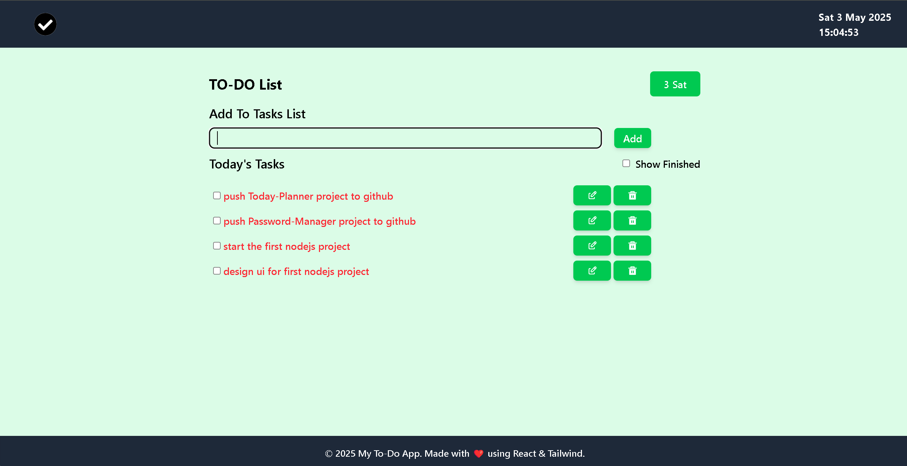
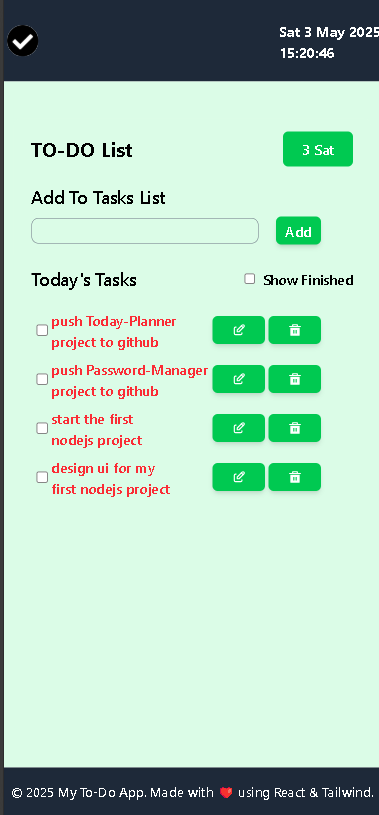

# ✅ Today Planner

A simple, local-storage-based task manager for organizing and tracking your daily tasks.

---

## 📸 Screenshots

### 💻 Desktop View  


### 📱 Mobile View  


---

## 📝 Features

- Add, update, and delete tasks  
- Tasks are stored and fetched from localStorage  
- Checkbox to mark tasks as completed  
- Built with React, Vite, and Tailwind CSS for a fast and responsive experience  

---

## 🛠️ Tech Stack

- React  
- Vite  
- Tailwind CSS  
- JavaScript  
- HTML  

---

## 🚀 Getting Started

1. Clone the repository  
2. Install dependencies:

   ```bash
   npm install
   npm install tailwindcss @tailwindcss/forms

3. Start the development server:
   npm run dev